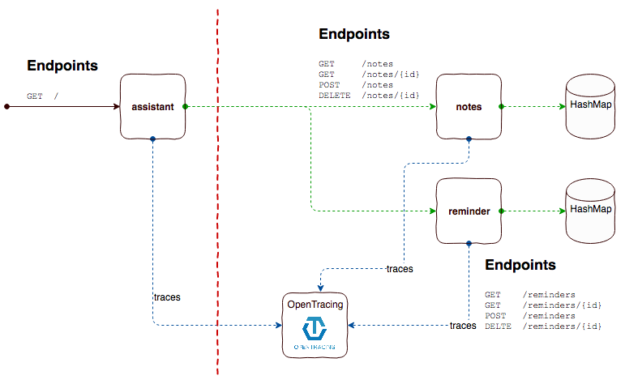

# OpenTracing example

This is an example showing how to use vanilla [OpenTracing](http://opentracing.io) in a [kotlin](https://kotlinlang.org) project with [SparkJava](http://sparkjava.com).

## Branches
* **master:** Shows the integration using [jaeger](http://jaegertracing.io)
* **tracer/zipkin:** Shows the integration using [zipkin](https://zipkin.io)

## Architecture



## Starting the project
Each service is a maven project and comes with a Dockerfile. I am using a BOM here so build the root folder first. On root level a docker-compose file is provided to startup all services together with the respective tracer server.

Most convenient way is the bash script which build everything and uses docker-compose to start it all up:
```
$ sh buildAndStart.sh
```